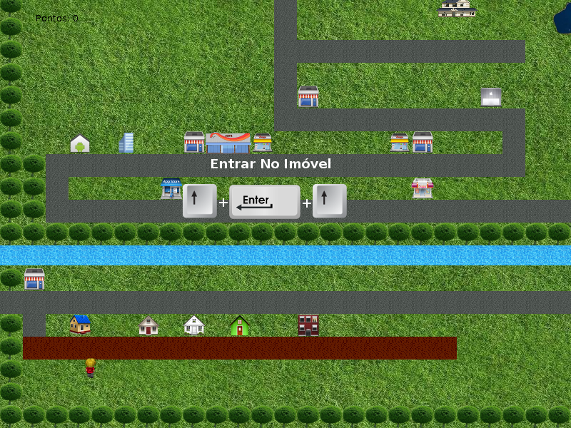

# Quiz Gamification

Java application using JPlay library to contruct a simple/sample chat quiz on a gamefication environment.

The program/game consists on a graphic interface with a character that walks around te game world and when colides with a house, the game asks a question.

This program was developed on 2016, source code should not be took in consideration :) The repository started on 2020, just at this time I've refatored folder structure and documented it.

The gamification looks like this:




### How do I get set up? ###

To run this game locally, first of all you need to clone this repository, the project had the following requirements: 

#### Requirements ####

* mysql (optional): if exists, game saves state on localhost
* java

### Running Locally ###

To run the game locally, you need to run the following command to compile:

```sh
./build.sh
```

and then, start playing:

```sh
./run.sh
```